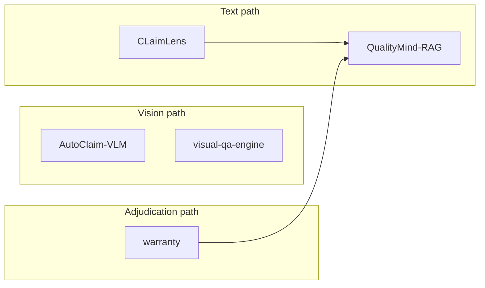

<div align="center">

# Quality Systems Portfolio

### Connected-vehicle & manufacturing quality — multi-repo workspace

<br />

[](QUALITY-SYSTEMS-GUARDRAILS.md)
[](https://vgandhi1.github.io/quality-systems-AI/)
[](TEXT-NARRATIVE-PATH.md)

<br />

[Guardrails](QUALITY-SYSTEMS-GUARDRAILS.md) · [Text path](TEXT-NARRATIVE-PATH.md) · [Adjudication path](WARRANTY-ADJUDICATION-PATH.md) · [Warranty POC](warranty/README.md)

</div>

---

Umbrella repo for **cross-project glue** — guardrails, path docs, simulations, and the tracked [`warranty/`](warranty/) POC.  
Sibling project folders (`CLaimLens/`, `QualityMind-RAG/`, etc.) are **separate git repos**, gitignored here.

## Three quality paths



| Path | Domain | Lead project |
|------|--------|--------------|
| **Text** | Field warranty narratives → plant RCA | [CLaimLens](https://github.com/vgandhi1/claimlens) → [QualityMind-RAG](https://github.com/vgandhi1/QualityMind-RAG) |
| **Vision** | Damage photos & line-side inspection | [AutoClaim-VLM](https://github.com/vgandhi1/AutoClaim-VLM) · [automotive-visual-qa-engine](https://github.com/vgandhi1/automotive-visual-qa-engine) |
| **Adjudication** | Dealership **payment** claim routing | [**warranty/**](warranty/) — [live deck](https://vgandhi1.github.io/quality-systems-AI/) |

Also in workspace: [cell-to-pack](https://github.com/vgandhi1/cell-to-pack) (EV battery assembly vision).

## Projects

| Folder | One-liner | Git |
|--------|-----------|-----|
| `CLaimLens/` | Narrative NLP, batch Pareto RCA | [claimlens](https://github.com/vgandhi1/claimlens) |
| `QualityMind-RAG/` | RAG + LangGraph quality assistant | [QualityMind-RAG](https://github.com/vgandhi1/QualityMind-RAG) |
| `AutoClaim-VLM/` | VLM damage intelligence | [AutoClaim-VLM](https://github.com/vgandhi1/AutoClaim-VLM) |
| `automotive-visual-qa-engine/` | Trim/surface inspection routing | [automotive-visual-qa-engine](https://github.com/vgandhi1/automotive-visual-qa-engine) |
| `cell-to-pack/` | Cell-to-pack vision orchestrator | [cell-to-pack](https://github.com/vgandhi1/cell-to-pack) |
| **`warranty/`** | Multi-agent payment adjudication (T2) | **This repo** — [README](warranty/README.md) |

## Tracked at this root

| Doc / tool | Purpose |
|------------|---------|
| [QUALITY-SYSTEMS-GUARDRAILS.md](QUALITY-SYSTEMS-GUARDRAILS.md) | Contracts, security, testing rules |
| [TEXT-NARRATIVE-PATH.md](TEXT-NARRATIVE-PATH.md) | Text-path architecture |
| [WARRANTY-ADJUDICATION-PATH.md](WARRANTY-ADJUDICATION-PATH.md) | Adjudication boundaries + `RcaEscalation` |
| [PUBLISHER-SUBSCRIBER-SIMULATION.md](PUBLISHER-SUBSCRIBER-SIMULATION.md) | CLaimLens → QualityMind simulation |
| [scripts/simulate_text_path.py](scripts/simulate_text_path.py) | Stdlib HTML report generator |

## Git workflow

```bash
# Separate repos — commit inside each folder
git -C CLaimLens status
git -C QualityMind-RAG status

# warranty — commit from this root
git add warranty/ && git status
```
