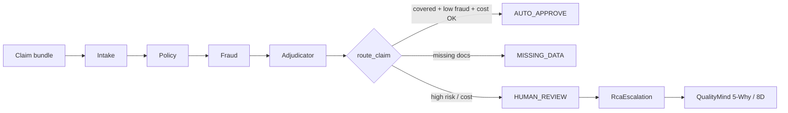

<div align="center">

# Warranty Claims Agent

### Multi-agent dealership payment adjudication

**Intake → Policy → Fraud → Adjudicator** with a deterministic routing gate

<br />

[](https://vgandhi1.github.io/quality-systems-AI/)
[](presentation.html)
[](plan.md)
[](../QUALITY-SYSTEMS-GUARDRAILS.md)
[](LICENSE)

<br />

[Live deck](https://vgandhi1.github.io/quality-systems-AI/) · [Source](presentation.html) · [Deep dive](doc.md) · [Adjudication path](../WARRANTY-ADJUDICATION-PATH.md) · [LAN access](DEV-LAN-ACCESS.md)

</div>

---

## What it does

Dealerships submit warranty **payment claims** as forms, OBD-II diagnostics, and attachments. This POC automates the adjuster workflow:

| Stage | Agent | Output |
|-------|-------|--------|
| 1 | **Intake** | DTCs, parts, labor hours, total cost |
| 2 | **Policy** | Coverage decision + missing document list |
| 3 | **Fraud** | Risk score 0–100 with justification |
| 4 | **Adjudicator** | Route suggestion → **`route_claim()` gate** |



> **Authoritative routing** lives in `validation.route_claim()` — the LLM's `submit_decision` is advisory and always overridden by the gate.

---

## Quick start

<table>
<tr>
<td width="33%" valign="top">

### Install

```bash
cd warranty
uv sync --extra dev --extra api
cp .env.example .env
```

</td>
<td width="33%" valign="top">

### Test (offline)

```bash
uv run pytest
uv run ruff check .
uv run python evaluate.py --check
```

</td>
<td width="33%" valign="top">

### Run API

```bash
uv run warranty-api
# → http://localhost:8080/docs
```

</td>
</tr>
</table>

### Dry-run scenarios (no LLM)

```bash
uv run python -m warranty.orchestrator --dry-run --scenario auto_approve
uv run python -m warranty.orchestrator --dry-run --scenario missing_logs
```

| Scenario | Expected route | Claim ID |
|----------|----------------|----------|
| `auto_approve` | `AUTO_APPROVE` | WAR-99001 |
| `missing_logs` | `HUMAN_REVIEW` (after doc resume) | WAR-10452 |

### Live LLM run

Set `ANTHROPIC_API_KEY` or `AGENTFORGE_LLM_PROVIDER=ollama`, then:

```bash
uv run python -m warranty.orchestrator --scenario auto_approve
```

---

## API endpoints

| Method | Path | Description |
|--------|------|-------------|
| `GET` | `/health` | Status, version, auth mode |
| `POST` | `/adjudicate/dry-run` | Deterministic pipeline (`{"scenario":"auto_approve"}`) |
| `POST` | `/escalate/handoff` | Build `RcaEscalation` from claim state |
| `POST` | `/escalate/execute` | Handoff + live POST to QualityMind |

**Local dev** — binds `127.0.0.1:8080`, no API key required.

**LAN / shared network** — set `WARRANTY_API_HOST=0.0.0.0` and `WARRANTY_API_KEY` (see [DEV-LAN-ACCESS.md](DEV-LAN-ACCESS.md)).

---

## Routing thresholds (pinned)

| Constant | Value | Effect |
|----------|-------|--------|
| `AUTO_APPROVE_COST_LIMIT` | $1,500 | Above → `HUMAN_REVIEW` |
| `AUTO_APPROVE_FRAUD_MAX` | 30 | Below + covered → eligible for auto |
| `HUMAN_REVIEW_FRAUD_MIN` | 70 | At or above → `HUMAN_REVIEW` |

Re-run `python evaluate.py` after any threshold change.

---

## Package layout

```
warranty/
├── presentation.html      ← deck source ([live](https://vgandhi1.github.io/quality-systems-AI/))
├── src/warranty/          ← Python package (v0.2.0)
├── evaluate.py            ← offline scenario harness
├── models/metrics.json    ← pinned eval results
├── tests/
│   ├── unit/              ← validation, routing, policy, handoff
│   ├── integration/     ← API, orchestrator, mocked tool loop
│   └── contract/          ← RcaEscalation ↔ QualityMind schema
└── workspace/             ← local claim sandbox (gitignored)
```

### Key modules

| Module | Role |
|--------|------|
| `claim_tools.py` | Sandboxed VIN, policy, labor, claim state |
| `validation.py` | Validators + **`route_claim()`** gate |
| `schema.py` | Pydantic models + `RcaEscalation` contract |
| `handoff.py` | Build QualityMind escalation payload |
| `qualitymind_client.py` | SSRF-safe HTTP client |
| `orchestrator.py` | CLI pipeline (`--dry-run` or live LLM) |
| `api.py` | FastAPI service |

---

## Portfolio boundaries

| Path | Domain | Schema |
|------|--------|--------|
| **warranty** (this repo) | Dealership **payment** claims | `RcaEscalation` |
| CLaimLens | Field warranty **narratives** | `RcaHandoff` (batch Pareto) |
| AutoClaim-VLM | Insurance **damage photos** | VLM routing |
| QualityMind-RAG | Manufacturing RCA | 5-Why, 8D, CAPA |

Do **not** mix `RcaHandoff` into warranty — different domains and contracts.

---

## Compliance & status

| Area | Status |
|------|--------|
| Tier | **T2** release-ready (dev environment) |
| Tests | 70 offline · 50% CI coverage gate |
| AI security | `<context>` delimiters · temp 0 · 30s timeout |
| API auth | Fail-closed production · LAN key required |
| Eval harness | `evaluate.py --check` in CI |

Full checklist: [plan.md](plan.md)

---

## License

MIT — see [LICENSE](LICENSE). Copyright (c) 2026 Vinay Gandhi.

Synthetic fixtures only. Not production warranty or payment software.
