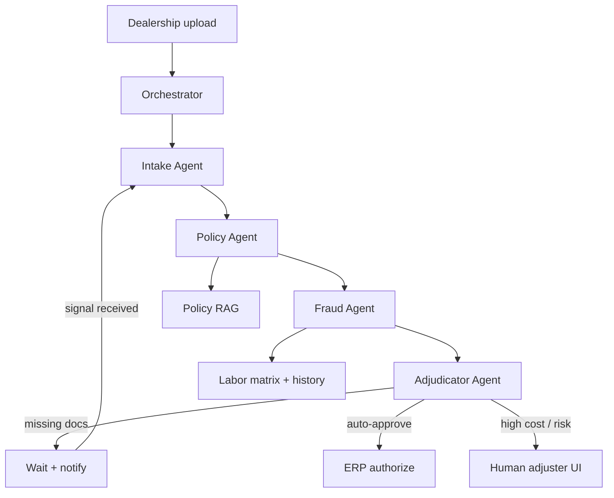

# Autonomous Automotive Warranty Claims System

> **Status:** Runnable POC in this directory. See [README.md](./README.md) for install and commands.
>
> **Design lineage:** Mirrors AgentForge orchestration patterns (multi-turn tool loop, independent reviewer gate, bounded revision cycles, path-sandboxed tools) proven in `agent-forge/contracts/` and `graphics/`.

## 1. Problem Statement

Dealerships submit warranty claims as a messy bundle: claim forms, OBD-II scan PDFs, mechanic notes, and sometimes video. Human adjusters spend **4–7 days** per claim cross-checking OEM manuals, VIN eligibility, labor matrices, and fraud signals.

A practical agentic system must:

1. **Extract** structured defect data from unstructured inputs (not brittle OCR-only pipelines).
2. **Verify** coverage against OEM policy with metadata-filtered retrieval (not blind vector search).
3. **Score** fraud risk from labor variance and dealership history.
4. **Route** to auto-approve, request missing docs, or human review — with a **durable claim state** that survives async waits (dealership replies days later).

Plain LLM chat cannot do this reliably. You need **specialist agents with tools**, a **supervisor orchestrator**, and **explicit gates** before any ERP payment.

## 2. Architecture Overview



### Why not Temporal + Kafka on day one?

Production scale needs Temporal for long-running waits and Kafka for decoupled ingestion. The POC uses a **thin Python orchestrator** with a JSON claim-state file so you can prove the agent loop offline, then embed the same tool contracts in Temporal activities or LangGraph nodes later.

| Layer | Responsibility | POC module |
|-------|----------------|------------|
| Tool layer | VIN lookup, policy search, labor matrix, claim state | `claim_tools.py` |
| Personas | System prompts + Anthropic tool schemas | `personas.py` |
| Orchestrator | Intake → Policy → Fraud → Adjudicate (bounded) | `orchestrator.py` |
| LLM adapter | Anthropic or Ollama | `llm.py` |
| Samples | Fixture claims, policies, VIN registry | `make_samples.py` |

## 3. Agent Roster

### 3.1 Orchestrator (Supervisor)

**Role:** Claim workflow controller and state owner.

**Responsibilities:**

- Accept a claim bundle path and instruction.
- Run agents in order: Intake → Policy → Fraud → Adjudicator.
- On `MISSING_DATA`, pause (simulated in POC), record required items, and resume when attachments arrive.
- Persist claim state to `workspace/.claim_state.json` after each agent.

**Tools:** `read_claim_state`, `write_claim_state` (no direct policy or fraud logic).

### 3.2 Intake Agent

**Goal:** Convert unstructured claim inputs into structured JSON.

**Tools:**

| Tool | Purpose |
|------|---------|
| `read_claim_form` | Parse dealership claim JSON (VIN, parts, labor hours, cost) |
| `read_diagnostic_report` | Read OBD-II scan text / mechanic notes |
| `write_intake_findings` | Record extracted codes, parts, timestamps |

**Rules:**

- Always read claim form and diagnostic report before writing findings.
- Output strict JSON: `identified_parts`, `extracted_codes`, `labor_hours`, `total_cost`.
- Flag `visual_evidence` only when explicitly present in inputs (no hallucinated timestamps).

**Example system prompt:**

```text
You are an Automotive Diagnostic Data Extractor. Read the claim form and diagnostic
report. Extract fault codes, failed components, labor hours, and total cost. Write
findings via write_intake_findings. Do not invent codes not present in the documents.
```

### 3.3 Policy Agent (RAG)

**Goal:** Verify eligibility against OEM warranty policy.

**Tools:**

| Tool | Purpose |
|------|---------|
| `lookup_vin` | Warranty active status, mileage, model year |
| `search_policy` | Metadata-filtered policy chunk search (model, year, component) |
| `write_policy_evaluation` | Coverage decision + clause citation + missing-doc flags |

**RAG strategy (production target):**

- **Parent chunks:** manual sections (e.g. "Section 4: Powertrain").
- **Child chunks:** fault codes / sub-components (e.g. "4.1.2: TCM").
- **Pre-filter** Qdrant by `model_year`, `vehicle_model`, `component_category` before semantic search.

**POC:** `search_policy` uses keyword + metadata filter over `workspace/policy_manual.json`.

**Example metadata filter:**

```json
{
  "model_year": [2022, 2023, 2024],
  "vehicle_model": ["Accord", "Civic"],
  "component_category": "Powertrain",
  "document_type": "Service_Bulletin"
}
```

### 3.4 Fraud Agent

**Goal:** Score inflated labor, duplicate patterns, and dealership velocity.

**Tools:**

| Tool | Purpose |
|------|---------|
| `get_labor_matrix` | OEM standard hours for repair operation |
| `get_dealership_history` | Claim velocity, prior fraud flags |
| `write_fraud_assessment` | Score 0–100 + justification |

**Rules:**

- Compare requested labor hours vs matrix variance.
- Score ≥ 70 → force human review regardless of cost.
- Never log PII (customer name, phone) — only dealership ID and claim ID.

### 3.5 Adjudicator Agent (Routing Gate)

**Goal:** Synthesize prior agents and emit a routing decision.

**Tools:**

| Tool | Purpose |
|------|---------|
| `read_claim_state` | Full claim payload |
| `submit_decision` | `AUTO_APPROVE` \| `MISSING_DATA` \| `HUMAN_REVIEW` |

**Routing logic:**

| Condition | Decision |
|-----------|----------|
| Policy `missing_docs` non-empty | `MISSING_DATA` — pause workflow, notify dealership |
| Covered + fraud score < 30 + cost < $1,500 | `AUTO_APPROVE` |
| Otherwise | `HUMAN_REVIEW` |

**Silence ≠ approval.** Adjudicator must call `submit_decision` exactly once.

## 4. Claim State (Handoff Payload)

Every run maintains JSON under `workspace/.claim_state.json`:

```json
{
  "claim_id": "WAR-10452",
  "dealership_id": "DLR-4458",
  "vin_data": {
    "vin": "1HGCM82633A004352",
    "warranty_active": true,
    "mileage": 42050,
    "model_year": 2023,
    "vehicle_model": "Accord"
  },
  "intake_findings": {
    "identified_parts": ["hybrid_battery_module"],
    "extracted_codes": ["P0A7F"],
    "labor_hours": 6.5,
    "total_cost": 4500
  },
  "policy_evaluation": {
    "is_covered": true,
    "relevant_clause_id": "SB-2023-HYB-01",
    "missing_docs": ["battery_cell_voltage_logs"],
    "citation": "Hybrid battery replacement covered 8yr/100k; requires cell voltage logs."
  },
  "fraud_assessment": {
    "score": 12,
    "justification": "Labor within 0.5h of matrix; dealership claim velocity normal."
  },
  "decision": null,
  "status": "IN_PROGRESS",
  "audit_trail": ["intake_done", "policy_done"]
}
```

Agents receive **claim_id** and relative paths only. All I/O resolves under `--root` (default: `warranty/workspace/`).

## 5. End-to-End Workflow (Concrete Example)

**Scenario:** Hybrid battery claim missing voltage logs.

```text
1. Dealership uploads claim.json + diagnostic.txt → Orchestrator starts WAR-10452
2. Intake Agent:
     read_claim_form("claim.json")           → VIN, P0A7F, $4,500
     read_diagnostic_report("diagnostic.txt")
     write_intake_findings(...)              → structured payload
3. Policy Agent:
     lookup_vin("1HGCM82633A004352")         → warranty active, 42k mi
     search_policy(component="hybrid_battery") → clause + requires voltage logs
     write_policy_evaluation(missing_docs=["battery_cell_voltage_logs"])
4. Fraud Agent:
     get_labor_matrix("hybrid_battery_replace") → 6.0h standard
     write_fraud_assessment(score=12)
5. Adjudicator:
     submit_decision("MISSING_DATA", notify="Upload cell voltage logs")
6. [2 days later] Mechanic uploads voltage_logs.txt → workflow resumes at Intake
7. Policy re-run confirms coverage; Adjudicator → HUMAN_REVIEW (cost > $1,500)
```

Run offline (no LLM):

```bash
cd warranty && uv sync && uv run python -m orchestrator --dry-run
```

Run with LLM:

```bash
uv run python -m orchestrator --scenario missing_logs
```

## 6. Security & Compliance

| Control | POC | Production target |
|---------|-----|-------------------|
| PII redaction | Strip customer fields from logs | Presidio before external LLM calls |
| Path traversal | `_SAFE_REL` + `resolve().relative_to(root)` | Same |
| Audit trail | Append-only `audit_trail` in claim state | Tamper-evident log store |
| Encryption | N/A in local POC | TLS 1.3 in transit, AES-256 at rest |
| AuthZ | Sandbox only | Per-dealership API keys + role checks |

Log claim IDs and operation outcomes — never log API keys, full diagnostic bodies with PII, or payment tokens.

## 7. Technology Stack

| Component | POC choice | Production target |
|-----------|------------|-------------------|
| Orchestration | Python async loop | Temporal.io on Kubernetes |
| Event bus | Direct function calls | Kafka / EventBridge |
| Vector DB | JSON + keyword filter | Qdrant cluster |
| Relational DB | JSON fixtures | PostgreSQL (VIN registry) |
| Claim state | `.claim_state.json` | MongoDB + Temporal signals |
| Multimodal LLM | Text-only in POC | Gemini 1.5 Pro / GPT-4o for video |
| Embeddings | Keyword match | text-embedding-3-large |
| Env / deps | uv + pyproject.toml | EKS + S3 media store |

## 8. Human-in-the-Loop UI (Future)

When routed to `HUMAN_REVIEW`, the adjuster UI should show:

- **Synchronized media player** with evidence markers (e.g. `02:14 — grind noise`).
- **Citation panel** with the exact policy clause from RAG.
- **One-click actions:** Approve, Deny, or natural-language re-eval prompt.

The POC writes `decision_report.md` summarizing agent outputs for manual review.

## 9. Implementation Roadmap

| Phase | Deliverable | Status |
|-------|-------------|--------|
| 1 | Tool sandbox + `--dry-run` deterministic pipeline | **Done** — `orchestrator.py --dry-run` |
| 2 | Personas + tool schemas per agent | **Done** — `personas.py` |
| 3 | Orchestrator + adjudication routing | **Done** — Intake → Policy → Fraud → Adjudicate |
| 4 | Missing-data pause / resume simulation | **Done** — `--scenario missing_logs` |
| 5 | Multimodal intake (video + PDF) | Open |
| 6 | Temporal workflow + email signals | Open |
| 7 | Qdrant RAG + production ERP hook | Open |
| 8 | AgentForge `warranty` preset | Open |

## 10. AgentForge Integration Path

To promote this POC to a first-class AgentForge preset:

1. Move `claim_tools.py` handlers into `@tool` decorators on domain agents.
2. Register a `warranty` preset: `intake → policy → fraud → adjudicator → qa`.
3. Reuse `BaseAgent.run_tool_loop` path validation from `core/artifact_store.py`.
4. Add eval fixtures under `evals/fixtures/warranty/` with deterministic `--dry-run` grading.

Reference implementations: `agent-forge/contracts/` (legal revision) and `graphics/` (document editing).
